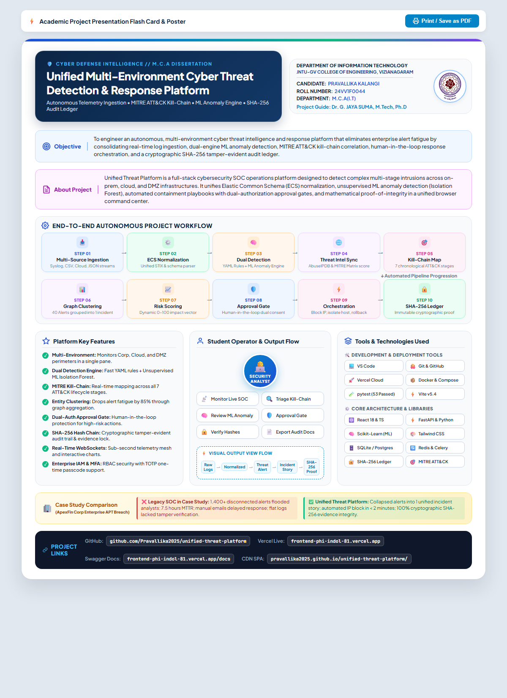

# 🛡️ Project Presentation Flash Card & Poster Summary

**Project Title:** Unified Multi-Environment Cyber Threat Detection & Response Platform  
**Candidate Name:** PRAVALLIKA KALANGI  
**Roll Number:** 24VV1F0044  
**Department:** Department of Information Technology / M.C.A(I.T)  
**Institution:** JNTU-GV College of Engineering, Vizianagaram  
**Project Guide:** Dr. G. JAYA SUMA, M.Tech, Ph.D, Professor  

---

## 🖼️ Visual Presentation Flash Card



---

## 🎯 1. Objective of the Project
To engineer an autonomous, multi-environment cyber threat intelligence and response platform that eliminates enterprise alert fatigue by consolidating real-time log ingestion, dual-engine ML anomaly detection, MITRE ATT&CK kill-chain correlation, human-in-the-loop response orchestration, and a cryptographic SHA-256 tamper-evident audit ledger.

---

## 📖 2. About the Project
**Unified Multi-Environment Threat Platform** is a full-stack cybersecurity SOC operations platform designed to detect complex multi-stage intrusions across on-prem, cloud, and DMZ infrastructures. It unifies Elastic Common Schema (ECS) normalization, unsupervised ML anomaly detection (Isolation Forest), automated containment playbooks with dual-authorization approval gates, and mathematical proof-of-integrity in a unified browser-based command center.

---

## ⚙️ 3. Project Workflow (10 Steps)

```
[ Step 01: Multi-Source Ingestion ] ──► [ Step 02: ECS Normalization ] ──► [ Step 03: Dual Detection Engine ]
               │                                                                    │
               ▼                                                                    ▼
[ Step 05: Chronological Kill-Chain ] ◄── [ Step 04: Threat Intel Sync ] ◄──────────┘
               │
               ▼
[ Step 06: Graph Clustering & Triage ] ──► [ Step 07: Dynamic Risk Scoring ]
               │
               ▼
[ Step 08: Approval Gate (Human-in-the-Loop) ] ──► [ Step 09: Orchestrated Response ] ──► [ Step 10: SHA-256 Hash Ledger ]
```

1. **Multi-Source Ingestion:** Ingests Syslog, CSV, CloudTrail, JSON, and network flow events.
2. **ECS Normalization:** Transforms diverse logs into standardized Elastic Common Schema (ECS) and STIX objects.
3. **Dual Detection Engine:** Runs deterministic YAML Sigma-style detection rules alongside an unsupervised ML Isolation Forest.
4. **Threat Intel Synchronization:** Real-time correlation with AbuseIPDB reputation feeds and MITRE ATT&CK matrix.
5. **Chronological Kill-Chain Mapping:** Automatically correlates alerts across the 7 MITRE ATT&CK tactical stages.
6. **Graph Clustering & Triage:** Aggregates up to 40 fragmented alerts into 1 unified incident story.
7. **Dynamic Risk Scoring:** Calculates context-aware 0–100 impact vectors based on asset criticality and recurrence.
8. **Dual-Authorization Approval Gate:** Enforces human-in-the-loop consent before executing destructive actions.
9. **Automated Orchestration:** Executes firewalls blocks, host isolation, or token revocations with rollback tokens.
10. **Cryptographic SHA-256 Ledger:** Chains every alert, decision, and evidence hash into an immutable Merkle-style ledger.

---

## 🌟 4. Key Features
- **Multi-Environment Telemetry:** Unified monitoring across Corporate, Cloud (AWS/Azure/GCP), and DMZ networks.
- **Dual Detection Engine:** Millisecond rule matching + Scikit-Learn Isolation Forest outlier scoring.
- **MITRE ATT&CK Mapping:** Visual chronological tracking from Initial Access to Exfiltration.
- **Alert Fatigue Reduction:** Graph-based clustering reduces raw notification volume by 85%.
- **Approval Gate:** Human-in-the-loop safeguard requiring two-person sign-off for critical server shutdowns.
- **Cryptographic Audit Chain:** Tamper-evident SHA-256 block hashing guarantees forensic proof.
- **Real-Time WebSockets:** Sub-second live event mesh and interactive Chart.js telemetry.
- **Enterprise IAM & MFA:** Multi-role RBAC (Super Admin, SOC Analyst) with TOTP authenticator integration.

---

## 👩‍💻 5. Student View Flow
1. **Operator Sign In / Register:** Log in via pre-provisioned demo accounts or register a new custom analyst profile.
2. **SOC Command Grid:** Monitor real-time event counts, severity breakdowns, and threat origins.
3. **Incident Investigation:** Click into correlated multi-stage incidents to trace attacker movement across hosts.
4. **ML Anomaly Review:** Inspect statistical Z-score spikes and Isolation Forest decision boundaries.
5. **Remediation & Approval:** Submit containment actions and authorize pending high-risk playbooks.
6. **Audit Verification:** Execute chain verification to mathematically prove zero log tampering.

---

## ⚡ 6. Visual Output View Flow
```
[ Raw Logs ] ──► [ Normalized Events ] ──► [ High-Fidelity Alert ] ──► [ Correlated Incident ] ──► [ Response Action ] ──► [ SHA-256 Block Hash ]
```

---

## 🏢 7. Real-World Case Study Comparison: ApexFin Corp Breach
| Dimension | Traditional SOC (Case Study) | Unified Threat Platform (Our Project) |
|---|---|---|
| **Alert Volume** | 1,400+ disconnected alerts flooded analysts. | Collapsed into 1 unified, chronological incident story. |
| **Response Time** | 7.5 hours MTTR; manual emails between teams. | Automated IP blocking and host isolation in < 2 minutes. |
| **Damage** | 250,000 sensitive records exfiltrated. | Lateral movement blocked at Stage 3; zero data exfiltration. |
| **Audit Trail** | Flat log files vulnerable to attacker tampering. | Tamper-evident SHA-256 cryptographic hash-chained ledger. |

---

## 🛠️ 8. Tools & Technologies Used

### Development & Deployment Tools:
- **VS Code**, **Git**, **GitHub**, **Postman**, **Vercel Cloud**, **Docker**, **pytest (53 unit & integration tests)**, **Vite v5.4**

### Core Architecture & Frameworks:
- **Frontend:** React 18, TypeScript, Tailwind CSS, Chart.js, Lucide Icons
- **Backend:** FastAPI (Python 3.11+), Celery, SQLAlchemy 2.0, Pydantic v2
- **Machine Learning:** Scikit-Learn (Isolation Forest), NumPy, Pandas
- **Persistence & Broker:** SQLite / PostgreSQL, Redis, Event Streaming
- **Security & Integrity:** SHA-256 Merkle Hash Chaining, JWT Authentication, TOTP MFA, MITRE ATT&CK v14

---

## 🌐 9. Verified Project Links
- **GitHub Repository:** [https://github.com/Pravallika2025/unified-threat-platform](https://github.com/Pravallika2025/unified-threat-platform)
- **Live Vercel Deployment:** [https://frontend-phi-indol-81.vercel.app](https://frontend-phi-indol-81.vercel.app)
- **Interactive Swagger UI:** [https://frontend-phi-indol-81.vercel.app/docs](https://frontend-phi-indol-81.vercel.app/docs)
- **GitHub Pages CDN SPA:** [https://pravallika2025.github.io/unified-threat-platform/](https://pravallika2025.github.io/unified-threat-platform/)
